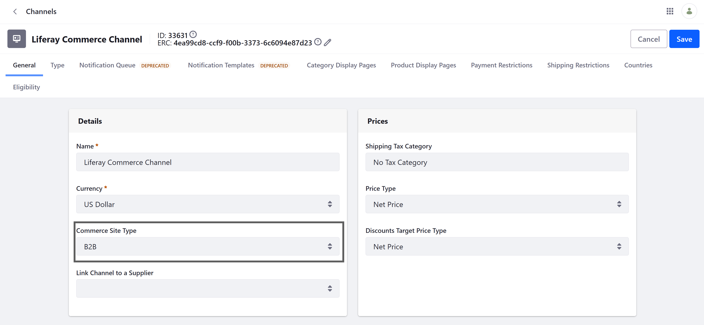

[Home](../../README.md)

# 1. Liferay Commerce: Overview

## Store Management

### Store Types

Liferay Commerce supports three types of stores:
- **B2B** (business to business): requires business accounts;
- **B2C** (business to consumer): requires personal accounts;
- **B2X** (combined): recognizes personal and business accounts.

### Configuration



Java: `com.liferay.commerce.product.constants.CommerceChannelConstants`:

	public static final int SITE_TYPE_B2B = 1;
	public static final int SITE_TYPE_B2C = 0;
	public static final int SITE_TYPE_B2X = 2;

DB:

```sql
select
    ppv.smallvalue
from
    portletpreferencevalue ppv
        inner join portletpreferences pp on pp.portletpreferencesid = ppv.portletpreferencesid
        inner join group_ g on g.groupid = pp.ownerid
        inner join commercechannel cc on cc.commercechannelid = g.classpk
where
    pp.portletId = 'com.liferay.commerce.account'
  and ppv.name = 'commerceSiteType'
  and cc.name = 'Liferay Commerce Channel'; 
    -- 1 = SITE_TYPE_B2B
```

### Channels

See https://learn.liferay.com/w/dxp/commerce/store-management/channels

**Channels** represent a place where you sell products: a Liferay customer portal, a B2B marketplace, or even back office phone sales.

Channel configuration options:
1. General: Details, Prices, Orders, Payment Methods, Shipping Methods, Tax Calculations.
2. Type: association with Liferay Site
3. Notification Queue (deprecated)
4. Notification Templates (deprecated)
5. Category Display Pages
6. Product Display Pages
7. Payment Restrictions
8. Shipping Restrictions
9. Countries
10. Eligibility: all accounts or specific account(s).