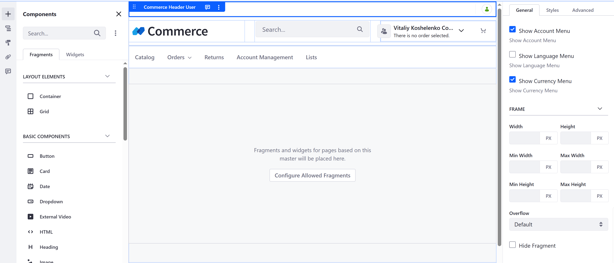

[Home](../../README.md)

# 3. Commerce Classic Site Initializer

Documentation: https://learn.liferay.com/w/dxp/commerce/starting-a-store/using-the-commerce-classic-site-initializer

## Overview 

Commerce Classic Site Initializer is a modern way to set up a new Liferay Commerce site using brand-new Liferay UI features for orders, account management and checkout process.

_**Note**: this feature is behind a beta feature flag (LPD-20379), and should be enabled in Feature Flags:_

## Pages Structure

A Liferay Commerce site created from Commerce Classic Site Initializer has the following pages structure:

- Catalog
  - Compare
  - Product Detail
- Orders
  - Pending Orders
    - Checkout
  - Placed Orders
- Returns
- Account Management
- Lists
- Search

## Master Page Overview

The Master Page Commerce Classic Overview has the following structure:

### Header
- #### Commerce Header User Fragment
    Displays the user profile menu, language and currency selectors.
    [Source Link](https://github.com/liferay/liferay-portal/tree/master/modules/apps/commerce/commerce-site-initializer/commerce-site-initializer/src/main/resources/site-initializer/fragments/group/commerce/fragments/header-user)
- #### Site Logo
- #### Search
- #### Commerce Components Group Fragment
    Displays account selector and mini-cart. 
    [Source Link](https://github.com/liferay/liferay-portal/tree/master/modules/apps/commerce/commerce-site-initializer/commerce-site-initializer/src/main/resources/site-initializer/fragments/group/commerce/fragments/commerce-components-group)
### DropZone
### Footer
Displays footer menu and social media links.

## Display Page Template Overview

The Order Display Page Template has the following structure:

### Order Header

##### UI

##### Description

Contains Order and Workflow status, Order name (customizable) and ERC, Checkout link and actions 

##### Components 

Fragments rendered with FragmentRenderer, available only with LPD-20379 feature flag:
- [Order Status Label](https://github.com/liferay/liferay-portal/blob/master/modules/apps/commerce/commerce-order-content-web/src/main/java/com/liferay/commerce/order/content/web/internal/fragment/renderer/StatusLabelFragmentRenderer.java)
- [Inline Editable Order Field](https://github.com/liferay/liferay-portal/blob/master/modules/apps/commerce/commerce-order-content-web/src/main/java/com/liferay/commerce/order/content/web/internal/fragment/renderer/InlineEditableOrderFieldFragmentRenderer.java)
- [Order Actions](https://github.com/liferay/liferay-portal/blob/master/modules/apps/commerce/commerce-order-content-web/src/main/java/com/liferay/commerce/order/content/web/internal/fragment/renderer/OrderActionsFragmentRenderer.java)

### Order Tabs

##### UI

##### Description

Tabs navigation between Order Details, Returns and Shipments

##### Components

Tabs fragment with DropZones.

### Order Steps

##### UI

##### Description

Displays progress on order steps.

##### Components

Fragment rendered with FragmentRenderer, available only with LPD-20379 feature flag:
- [Placed Order Shipments Data Set](https://github.com/liferay/liferay-portal/blob/master/modules/apps/commerce/commerce-order-content-web/src/main/java/com/liferay/commerce/order/content/web/internal/fragment/renderer/PlacedOrderShipmentsDataSetFragmentRenderer.java)

### Order Details

##### UI

##### Description

Displays order details: account and order information, shipping and billing addresses, payment method, etc.

##### Components

A Grid with [Info Box](https://github.com/liferay/liferay-portal/blob/master/modules/apps/commerce/commerce-order-content-web/src/main/java/com/liferay/commerce/order/content/web/internal/fragment/renderer/InfoBoxFragmentRenderer.java) fragments.

### Order Items

##### UI

##### Description

Displays information about order items.

##### Components

[Order Items Data Set](https://github.com/liferay/liferay-portal/blob/master/modules/apps/commerce/commerce-order-content-web/src/main/java/com/liferay/commerce/order/content/web/internal/fragment/renderer/OrderItemsDataSetFragmentRenderer.java)

### Order Items

##### UI

##### Description

Displays order summary information.

##### Components

A Grid with [Order Summary](https://github.com/liferay/liferay-portal/blob/master/modules/apps/commerce/commerce-order-content-web/src/main/java/com/liferay/commerce/order/content/web/internal/fragment/renderer/OrderSummaryFragmentRenderer.java) fragments.